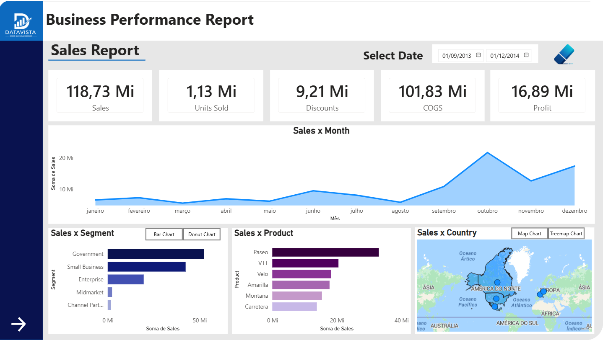
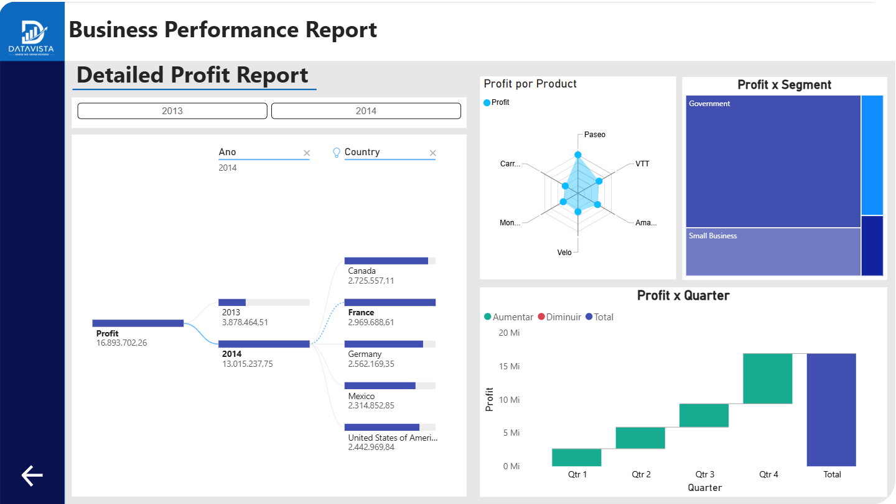

# Sales & Profit Analytics Report

Interactive dashboard developed in Power BI for sales and profit analysis.

## Project Overview

This project was created to analyze:

- Sales performance
- Profit metrics
- Product performance
- Segment analysis
- Country sales distribution
- Quarterly profit trends

The dashboard provides interactive navigation between pages and dynamic filtering for better business insights.

---

## Tools Used

- Power BI
- DAX
- Data Visualization
- Business Intelligence Concepts

---

## Dashboard Preview

### Executive Overview

### Detailed Profit Report

---

## Features

- Interactive navigation buttons
- KPI cards
- Time filtering
- Map visualization
- Treemap analysis
- Waterfall chart
- Dynamic visual interactions

---

## How to View

1. Download the `.pbix` file
2. Open using Power BI Desktop

